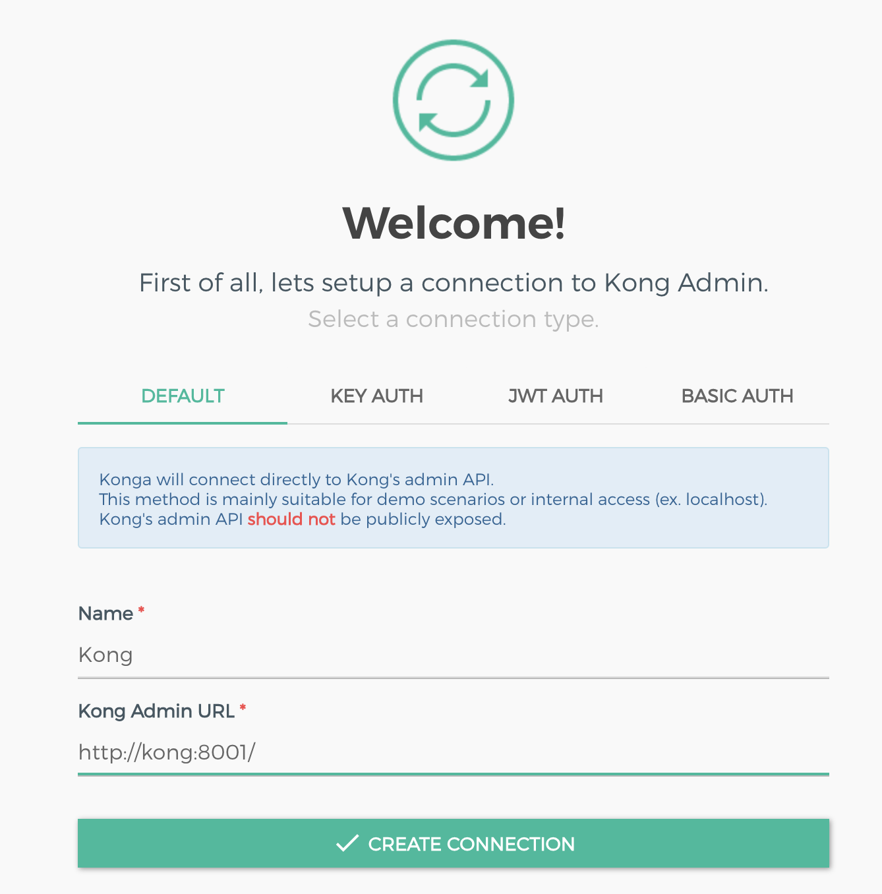

### DEMO Keycloak for OpenMed


#### Keycloak
1. Keycloak Run
    ```
    docker-compose up -d keycloak-db-postgres keycloak
    ```

2. Per Keycloak vai in http://localhost:8080/auth , Click su 
   Administration e autenticati
    ```
    user        : admin
    password    : admin
    ```

1. Keycloak export data (Optional)
   Una volta configurato puoi usare questo comando per esportare la config, quindi mentre gira il container lanciare il seguente comando.
   La comodita' e che se riavvi cancellando il container ha il volume associato per rileggere la conf.
   Per esempio ho chiamato realm e file da esportare e importare 'openmed'

    ```
    docker-compose exec keycloak /opt/jboss/keycloak/bin/standalone.sh \
        -Djboss.socket.binding.port-offset=100 -Dkeycloak.migration.action=export \
        -Dkeycloak.migration.provider=singleFile \
        -Dkeycloak.migration.realmName=openmed \
        -Dkeycloak.migration.usersExportStrategy=REALM_FILE \
        -Dkeycloak.migration.file=/tmp/config/openmed.json
    ```

#### Kong
1. Kong Run
    ```
    docker-compose up -d kong-db-postgres kong-migration
    ```

    Attendi qualche secondo che la migrazione abbia finito

    ```
    docker-compose up -d kong
    ```

#### Konga
1. Kong Run
    ```
    docker-compose up -d konga-db-postgres konga-migration
    ```
     Attendi qualche secondo che la migrazione abbia finito

    ```
    docker-compose up -d konga
    ```

2. Per Keycloak vai in http://localhost:1337 , autenticati e crea la connessione verso kong
    ```
    user        : admin
    password    : admin
    ```
    

#### Configure Service, Route, Plugin
   
1. Create service( modifica con url al servizio vero e name come si vuole)
   
    ```
    curl -i -X POST \
    --url http://localhost:8001/services/ \
    --data 'name=demo-fn-service' \
    --data 'url=http://mockbin.org'
    ```


```
curl -i -X POST http://localhost:8001/services/demo-fn-service/plugins \
  --data name="openid-connect"                                                                             \
  --data config.issuer="https://YOUR_OKTA_DOMAIN/oauth2/YOUR_AUTH_SERVER/.well-known/openid-configuration" \
  --data config.client_id="YOUR_CLIENT_ID"                                                                 \
  --data config.client_secret="YOUR_CLIENT_SECRET"                                                         \
  --data config.redirect_uri="https://kong.com/api"                                                        \
  --data config.scopes="openid"                                                                            \
  --data config.scopes="email"                                                                             \
  --data config.scopes="profile"
```

2. Create route (nell'url metti il nome del servizio scelto precedentemente e negli hosts il dominio da cui viene chiamato il servizio, nella mia demo era `server.massimoscattarella.com`, e configura come meglio credi)
   
   ```
   curl -i -X POST \
    --url http://localhost:8001/services/demo-fn-service/routes \
    --data 'hosts[]=server.massimoscattarella.com' \
    --data 'strip_path=false' \
    --data 'name=demo-fn-route' \
    --data 'paths[]=/guestbook/entries' \
    --data 'methods[]=GET'
   ```